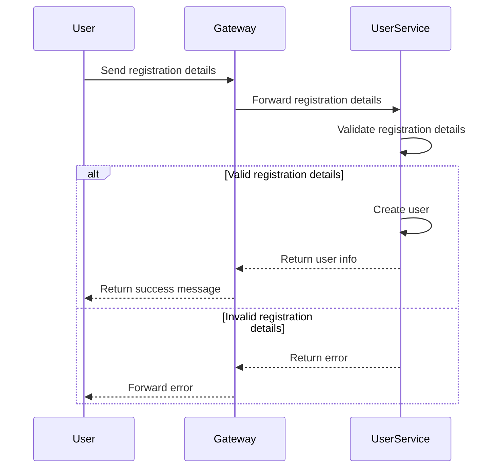
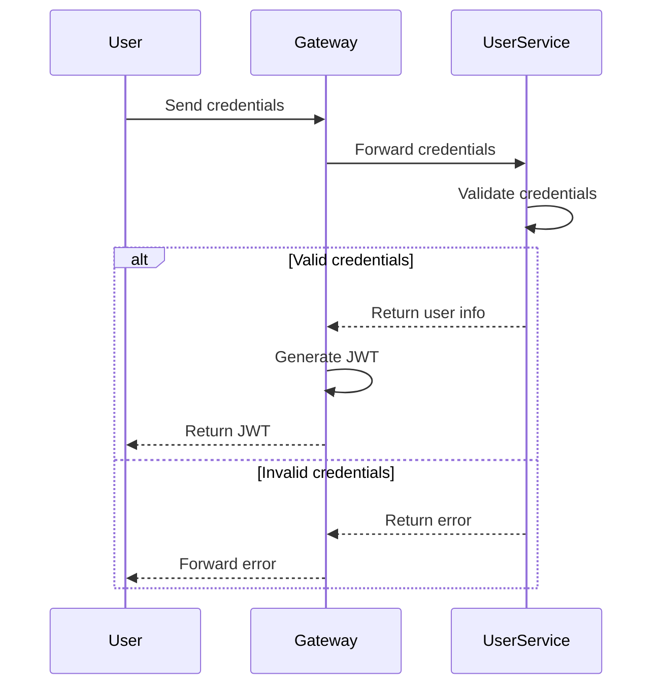
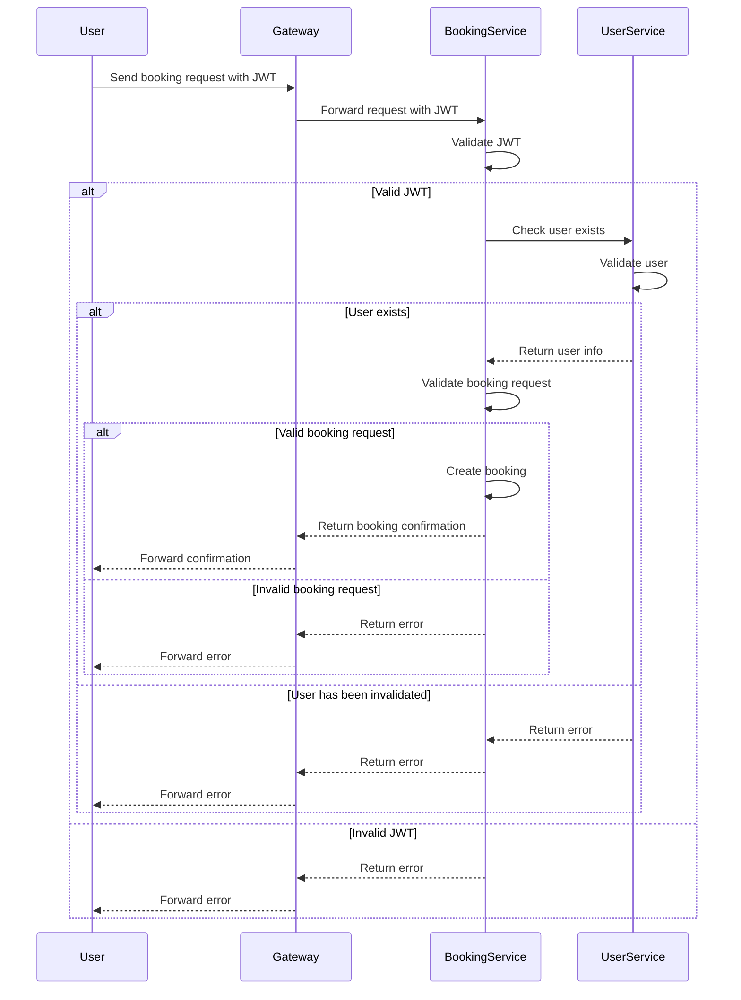

# microservices

[](https://github.com/chas-fjax25-molle/microservices/actions/workflows/test.yml)
## Getting Started

### Prerequisites

* Java 21+
* Maven
* Docker
* Docker Compose

---

### Build the project

From the project root, run:

```bash
mvn clean install
```

If you encounter test failures caused by missing external services (for example Vault), you can skip the tests:

```bash
mvn clean install -DskipTests
```

---

### Start the application

Start all microservices and infrastructure using Docker Compose:

```bash
docker compose up --build
```

The following services will be started:

| Service                   | Port     |
| ------------------------- | -------- |
| API Gateway               | 8080     |
| Service Registry (Eureka) | 8761     |
| Vault                     | 8202     |
| User Service              | internal |
| Booking Service           | internal |

You can verify that all services are running with:

```bash
docker compose ps
```

---

## Authentication Flow

The system uses JWT authentication.

1. Register a new user through the API Gateway.
2. Login through the API Gateway.
3. Receive a JWT token.
4. Include the token in the `Authorization` header when calling protected endpoints.

```
Authorization: Bearer <your-jwt-token>
```

---

## Register a User

```http
POST http://localhost:8080/api/gateway/users/register
```

Example body:

```json
{
  "username": "testuser",
  "email": "test@test.se",
  "password": "Password123"
}
```

---

## Login

```http
POST http://localhost:8080/api/gateway/auth/login
```

Example body:

```json
{
  "username": "testuser",
  "password": "Password123"
}
```

Successful login returns a JWT token.

---

## Calling Protected Endpoints

Include the JWT in the Authorization header.

Example:

```http
Authorization: Bearer eyJhbGciOi...
```

Example request:

```http
GET /api/booking-service/bookings
```

---

## Role-based Authorization

The Booking Service uses Spring Security with JWT authentication.

Examples:

| Endpoint           | Access         |
| ------------------ | -------------- |
| GET /events        | Public         |
| POST /events       | Public         |
| POST /bookings     | USER or ADMIN  |
| GET /bookings      | ADMIN          |
| GET /bookings/{id} | USER or ADMIN  |

---

## Stop the application

```bash
docker compose down
```

To also remove volumes:

```bash
docker compose down -v
```

## Program flow

### Registration



---

### Login



---

### Booking


