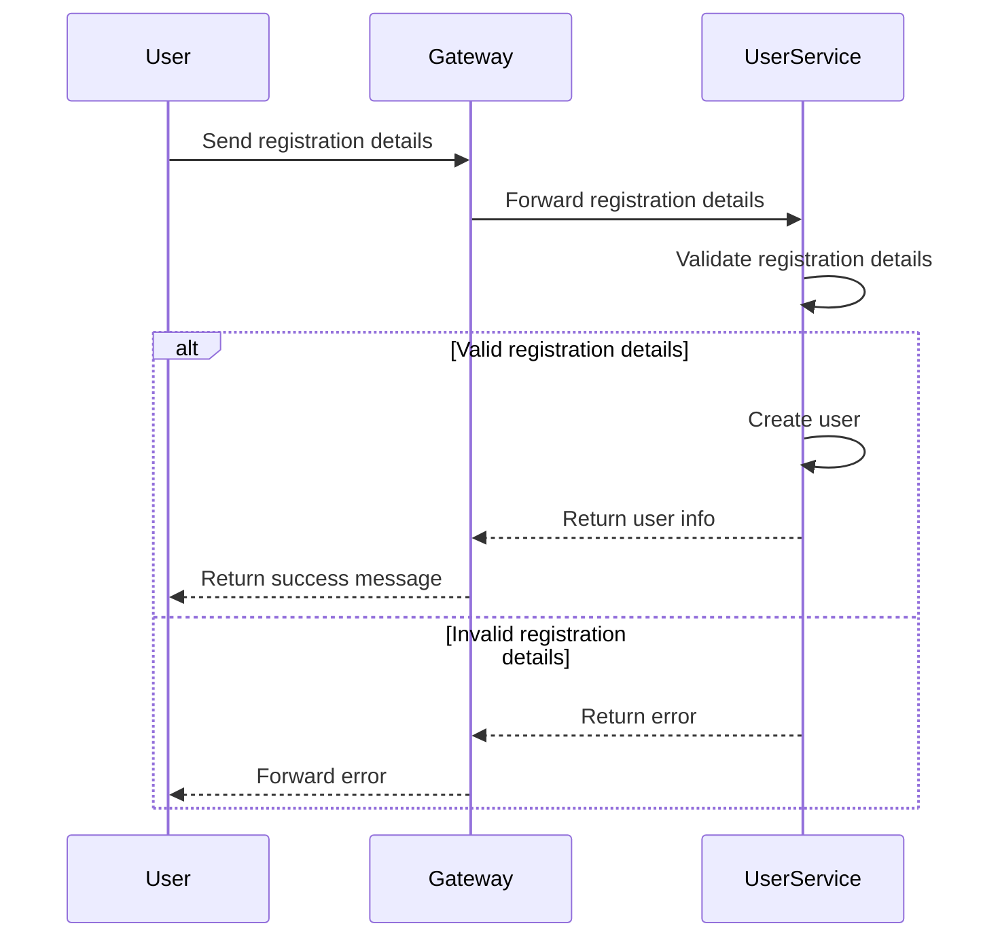
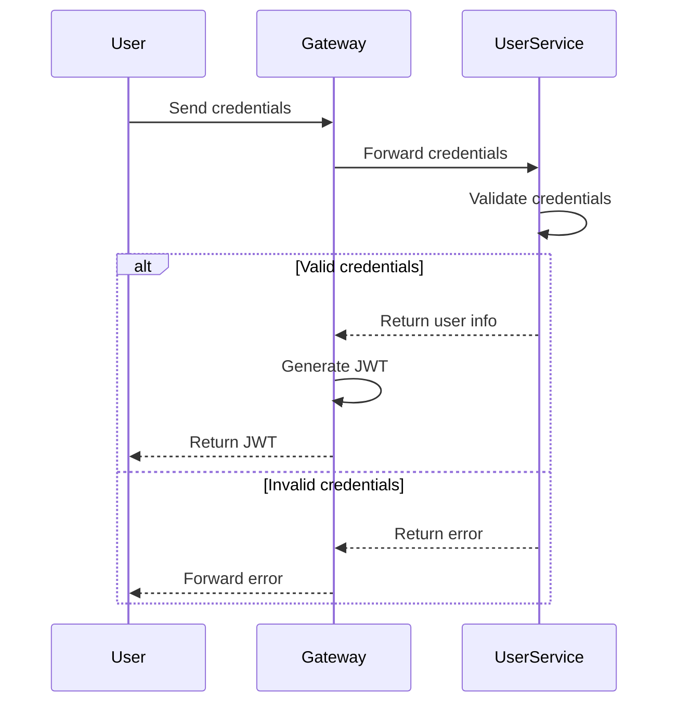
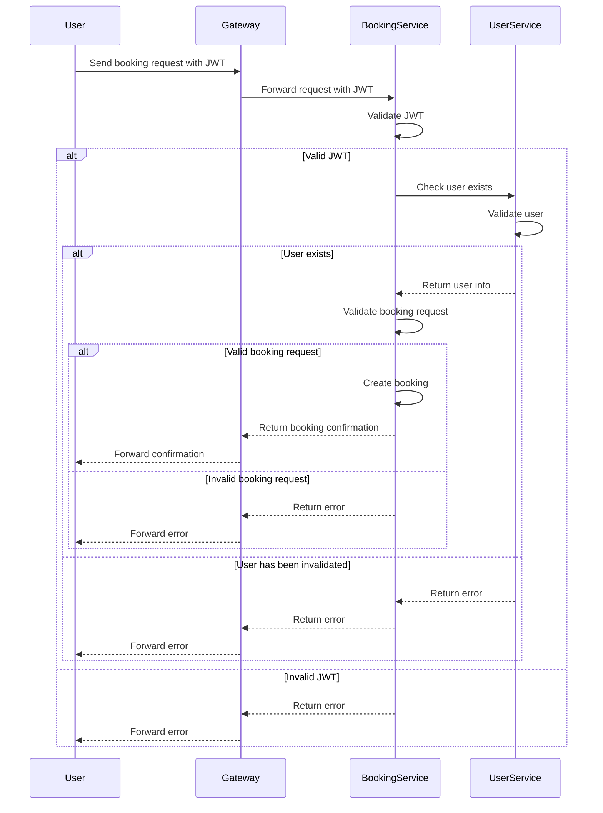

# microservices

## Program flow

### Registration

```mermaid
sequenceDiagram
    participant User
    participant Gateway
    participant UserService
    User->>Gateway: Send registration details
    Gateway->>UserService: Forward registration details
    UserService->>UserService: Validate registration details
    alt Valid registration details
        UserService->>UserService: Create user
        UserService-->>Gateway: Return user info
        Gateway-->>User: Return success message
    else Invalid registration details
        UserService-->>Gateway: Return error
        Gateway-->>User: Forward error
    end
```

---

### Login

```mermaid
sequenceDiagram
    participant User
    participant Gateway
    participant UserService

    User->>Gateway: Send credentials
    Gateway->>UserService: Forward credentials
    UserService->>UserService: Validate credentials
    alt Valid credentials
        UserService-->>Gateway: Return user info
        Gateway->>Gateway: Generate JWT
        Gateway-->>User: Return JWT
    else Invalid credentials
        UserService-->>Gateway: Return error
        Gateway-->>User: Forward error
    end
```

---

### Booking

```mermaid
sequenceDiagram
    participant User
    participant Gateway
    participant BookingService
    participant UserService

    User->>Gateway: Send booking request with JWT
    Gateway->>BookingService: Forward request with JWT
    BookingService->>BookingService: Validate JWT
    alt Valid JWT
        BookingService->>UserService: Check user exists
        UserService->>UserService: Validate user
        alt User exists
            UserService-->>BookingService: Return user info
            BookingService->>BookingService: Validate booking request
            alt Valid booking request
                BookingService->>BookingService: Create booking
                BookingService-->>Gateway: Return booking confirmation
                Gateway-->>User: Forward confirmation
            else Invalid booking request
                BookingService-->>Gateway: Return error
                Gateway-->>User: Forward error
            end
        else User has been invalidated
            UserService-->>BookingService: Return error
            BookingService-->>Gateway: Return error
            Gateway-->>User: Forward error
        end
    else Invalid JWT
        BookingService-->>Gateway: Return error
        Gateway-->>User: Forward error
    end

```
